<a id="readme-top"></a>

<div align="right">
	<spam>Languages</spam>

[](README.md)
[](README-EN.md)

</div>

# 🌐 Project slideshow


<div align="center">


  <details>
  <summary>Image description</summary>
  This image contains a blue “play” icon in the center, indicating the start of a project slideshow. The background has geometric shapes in dark blue tones, with the text “Project slideshow” at the top. It guides the user to click and start the presentation.
  </details>

</div>


---

<details>
<summary>Click here to view the table of contents</summary>
<br/>

:small_blue_diamond: [🌐 Project slideshow](#-project-slideshow)

:small_blue_diamond: [💡 About the project](#-about-the-project)

:small_blue_diamond: [🌐About the chosen site](#-about-your-chosen-site)

:small_blue_diamond: [📊Project status](#-project-status)

:small_blue_diamond: [🚀 Result](#-result)

:small_blue_diamond: [🧱 File/folder structure](#-filefolder-structure)

:small_blue_diamond: [📐 System design](#-system-design)

:small_blue_diamond: [🏗️ Architecture-structure-and-interaction-flow](#%EF%B8%8F-architecture-structure-and-interaction-flow)

:small_blue_diamond: [⚔️ Technologies](#%EF%B8%8F-technologies)

:small_blue_diamond: [📜 Glossary](#-glossary)

:small_blue_diamond: [📋 References](#-references)

:small_blue_diamond: [📝 Authors](#--authors)

:small_blue_diamond: [⚖️ License](#%EF%B8%8F-license)

</details>

# 💡 About the project

⚡ The AdrenalineStream API project is a JavaScript/NodeJS API implemented in Docker on AWS to extract relevant information from a website with content in RSS format. This application saves the data in a JSON file inside an S3 bucket, and allows the saved content to be consulted via an HTML page hosted on the AWS cloud.

---

<div align="center">

</div>

# 🌐 About your chosen site

- With more than 20 years' experience, Adrenaline is now the largest hardware website in
  Brazil. Every day, we bring you news, articles and analysis on components such as video cards, motherboards, processors and notebooks. In addition, we specialize in the gaming market, covering the launches of the main platforms - PC, PlayStation 5, Xbox Series X and Nintendo Switch.
- Every month, more than 5 million users visit our pages. There are more than 7 million page views on the site. We are also present on social media, especially our YouTube channel, with over 1 million subscribers. We also cover the main national and international events in the segment, including CES, MWC, Computex, IFA, BGS, among others.
- official website: https://www.adrenaline.com.br/
- rss site: https://www.adrenaline.com.br/feed/

---

# 📊 Project status

> [!NOTE]
> ☁️ In production on AWS

> [!TIP]
> 🔎 Any feedback please contact the developers

---

# 🚀 Result

> [!IMPORTANT]
> 🛰️ Project completed

> [!CAUTION]
> ⛔ After submission, the project will be excluded from aws so as not to generate costs

<div align="center">
  <a href="https://youtu.be/AidiFbGnn28" target="_blank"></a>
  
  <details>
  <summary>Image Description</summary>
  This image contains the YouTube logo in motion, suggesting that the user can click to watch the project's video. The logo is centered, and the GIF creates a sense of interactivity. By clicking on the image, the user will be redirected to the project's video on YouTube.
  </details>

</div>

---

<div align="left">
<b><h1>🧱 File/folder structure</h1></b>
</div>

<div align="left">
 
```
/AdrenalineStreamAPI
│
|── /docs                             # Folder for project documentation.
│   └── /Step by Step.PDF             # Documentation file on how the Application was Deployed on AWS with EC2, ECS, ECR and Docker.
|
|── /back-end                         # Folder reserved for everything in the application's back-end.
|   └── /src                          # Subfolder for the source of the back-end application.
|       └── /node_modules             # Subfolder containing all the dependencies and external libraries installed for the project, managed by npm / yarn.
|        |  └── ...	              # Dependencies and libraries.
|        |
|        |── /node-aws-s3-integration # Folder containing all the files and scripts needed for the API to work.
|        |   |── /routes              # Subfolder containing the routes file.
|        |   |   └── rss-api.js       # File that defines the API routes related to RSS processing and integration with Amazon S3.
|        |   |
|        |   |── /bucket-s3.js        # File containing the integration logic with the Amazon S3 service, responsible for uploading the file to the bucket.
|        |   └── /rss-parser.js       # File responsible for taking the information from the RSS URL and transcribing each item.
|        |
|        |── main.js                  # Main project file that starts the application and integrates the different modules and components of the project.
|        |── package-lock.json        # Self-generated file that guarantees the integrity of the exact versions of the installed dependencies.
|        |── package.json             # File that defines the project dependencies, execution scripts, and other settings related to the npm project.
|        |── .dockerignore            # File that lists the files and folders that should be ignored by Docker when creating the application image.
|        |── .env                     # File containing sensitive AWS environment variables and settings used by the application.
|        |── build.bat                # File in Windows batch script format, used to automate the construction of the project and send it to the ECR.
|        |── compose.bat              # File in batch script format for Windows, used to automate the composition of Docker containers.
|        |── docker-compose.yml       # Docker Compose configuration file, used to define and manage multiple Docker containers.
|        |── Dockerfile               # File containing the instructions for creating the project's Docker image.
|        |── login.bat                # File in batch script format for Windows, used to automate the login process on AWS.
|        └── yarn.lock                # File autogenerated by yarn that locks the exact versions of dependencies, similar to package-lock.json, but specific to yarn.
|
|── /front-end                        # Directory responsible for organizing the files related to the front-end.
│ |── /content                        # Directory responsible for maintaining CSS.
│ │   └── style.css                   # Site style.
│ │
│ |── /controllers                    # Controller files responsible for the interaction logic between view and model.
│ │   └── feedController.js           # Controller for handling feeds.
│ │
│ |── /models                         # Model files that represent the app's data/Objects and DTOs.
│ │   └── cardModel.js                # Card model and builder.
│ │
│ |── /utils                          # Auxiliaries.
│ │   |── fetchUtil.js                # Function to make fetch requests.
│ │   └── dateFormatter.js            # Function to return date in correct format.
│ │
│ └── index.html                      # Main HTML file for the front-end.
|
|── /assets                           # Folder containing media files and other resources used in the application.
│   └── /images                       # Specific subfolder for storing images used in the project.
|       └── /readme                   # Subfolder containing images used specifically in README.
|           |── compassuol.jpg        # CompassUOL image file, used in README.
|           |── logo_adrenaline.svg   # Image file from the chosen Adrenaline site, used in the README.
|           ├── youtube-logo.png      # Image file of the youtube logo, used in the README.
|           ├── sistema.svg           # Image file of the system design diagram, used in the README.
|           ├── sistema-en.svg        # Image file of the system design diagram in English, used in the README.
│           └── logo-projecto.gif     # Project logo gif image file.
|
├── README-EN.md                      # File for project documentation in English.
├── README.md                         # File for project documentation in Portuguese.
├── CODE_OF_CONDUCT.md                # Document file that establishes the conduct guidelines for the project community.
├── LICENSE                           # Document file describing the terms of the license under which the project is distributed.
├── SECURITY.md                       # Document file that addresses the project's security practices and policies.
└── .gitignore                        # File to indicate to Git which files/types of files should not be tracked.
```

</div>

---

# 📐 System design



</div>

```mermaid

graph TD;
    %% Project AdrenalineStream API
    subgraph AdrenalineStream API

        %% Deployment Flow
        ECS[Amazon ECS Cluster] -->|Runs Containers| EC2[Amazon EC2 Instance]
        EC2 -->|Deploy Container| ECR[Amazon ECR Docker Repository]
        ECR -->|Docker Image| BE[Back-end Server Container Node.js/Express]

        %% EC2 Instance and Containers
        subgraph EC2[Amazon EC2 Instance]
            VM[Virtual Machine]
            subgraph VM[Virtual Machine Docker]
                BE[Back-end Server Container Node.js/Express]
            end
        end

        %% Data Flow after "Start API"
        BE -->|Processes RSS and Saves JSON| S3[Amazon S3 JSON Bucket]
        HTML[HTML Static Website on S3] -->|"Start API"| BE

        %% Data Flow after "Fetch Data"
        S3 -->|"Returns JSON"| HTML
        HTML -->|"Fetches JSON from S3"| S3
        HTML -->|Displays JSON data| U[User]

        %% User interacting with the system
        U -->|"Click: Start API"| HTML
        U -->|"Click: Fetch Data"| HTML

    end

    %% Style Definitions
    classDef aws fill:#FF9900,stroke:#232F3E,stroke-width:2px,color:white;
    classDef vm fill:#1EC9E8,stroke:#232F3E,stroke-width:2px;
    classDef app fill:#4CAF50,stroke:#232F3E,stroke-width:2px;
    classDef external fill:#333,stroke:#232F3E,stroke-width:2px;
    classDef user fill:#000000,stroke:#232F3E,stroke-width:2px,color:white;

    class U user;
    class HTML,BE,RSS app;
    class S3 aws;
    class VM vm;
    class EC2,S3,ECR,ECS aws;
    class VM vm;
    class RSS external;

```

> [!warning]
> 🚧 GitHub mobile does not support mermaid, below is a diagram of the system design



<div align=“left”>

<details>
  <summary>Image Description</summary>
  This flowchart describes a system based on AWS:

- **Amazon ECS Cluster**: Manages the execution of containers.
- Amazon EC2 Instance\*\*: Hosts a virtual machine that runs a Docker environment.
- **Virtual Machine Docker**: Contains a container called “Back-end Server Container” that uses Node.js/Express.
- Back-end Server Container:
  - Processes RSS feeds and saves the data as JSON in Amazon S3.
  - Initializes an API that allows interactions with the system.
- Amazon ECR (Elastic Container Registry)\*\*: Hosts Docker images that are used to create containers on EC2.
- Amazon S3 Bucket JSON: Stores JSON files generated by processing RSS feeds.
- **HTML Static Site in S3**: Allows the user to view JSON data and interact with the API.
- User: Interacts with the system via the static site in S3.

### Flow:

1. The container is deployed on the EC2 instance from Amazon ECR.
2. The application in the container processes RSS feeds and stores the data in JSON on Amazon S3.
3. The static site on S3:
   - Displays the extracted JSON data.
   - It offers options for the user to start the API or make new queries.
4. The initialized API returns JSON data to the site for display to the user.

The diagram uses a dark grey background, with elements arranged in colored boxes:

- Orange for AWS services.
- Blue for containers and backend.
- Green for the static site and user interactions.
- Connections and arrows in light gray.

</details>

</div>

---

# 🏗️ Architecture structure and interaction flow

**1. User interface (UI)**
- HTML page (hosted on S3): the static HTML page hosted in an S3 bucket serves as the user interface.
- Start API" button: This button triggers a request to the Node.js API to start the RSS extraction and JSON saving process.
- Get Data" button: This button accesses the JSON file stored in the S3 bucket and displays the data to the user.

**1.1 Structure of the Front-End**
- The front-end was organized using the **MVC (Model-View-Controller)** standard, with a view to separating responsibilities and ease of maintenance:
- **/controllers**: Contains the controllers that manage the interaction between the interface (view) and the data (model).
  - `feedController.js`: Controller for GET in the API, GET in S3 and JSON handling
- **/models**: Defines the models that represent the data manipulated by the application
  - `cardModel.js`: Model for the card data displayed in the interface
- **/views**: Responsible for rendering the data
  - `cardView.js`: Manages the rendering of cards
- **/utils**: Contains utility functions
  - `fetchUtil.js`: Function for making HTTP requests
  - `dataFormatter.js`: Function to return date in correct format

**2. Back-end API (Node.js/Express application)**
- Docker container: the Node.js application is containerized using Docker.
- AWS Elastic Container Service (ECS): the Docker container is managed by AWS ECS and runs on an EC2 instance.
- RSS feed extraction: On receiving the request from the "Start API" button, the API extracts data from the RSS feed and saves it in json and sends it to an S3 bucket.

**2.1 EndPoints:**
- **GET** `/transcribe-rss`:
- - This endpoint returns a transcribed RSS feed from the specified URL and sends the json to the S3 bucket.
- - Parameters: url (string) - The URL of the feed in question.
- - Request: GET /http://.../transcribe- rss?url=https://www.adrenaline.com.br/feed/
- **GET** `/https://.../rss-transcriptions/RSS- dados-coletados.json`:
- - This endpoint returns a json from the s3 bucket that was sent by the API.
- - Parameters: url (string) - The URL of the json in question.
- - Request: GET /https://.../rss-transcriptions/RSS- dados-coletados.json
- Sample Answer
- - [{"title": "title of the recorded test report", "description": "description text of the test report", "pubDate": "Weekday | Month | Year | Time"}, ...]

**3. AWS infrastructure**
- Amazon EC2 instance: hosts the Docker container managed by ECS.
- Amazon Elastic Container Registry (ECR): stores Docker images for deployment.
- Amazon S3 bucket (data storage): the API saves the extracted data as a JSON file in this bucket.
- Amazon S3 bucket (static site): hosts the HTML page.

**4. Data flow:**
- User action: Start API: The user clicks "Start API" on the HTML page, sending a request to the Node.js API.
- RSS feed extraction: the API processes the RSS feed and saves the extracted data as a JSON file in the S3 bucket.
- User action: Fetch Data: the user clicks on "Fetch Data" and the HTML page fetches and displays the JSON data from the S3 bucket.

---

# ⚔️ Technologies

The following tools were used to develop this project:

<div align="center">

|                                                                                                                                                Tool                                                                                                                                                |                             Utilized                              |
| :------------------------------------------------------------------------------------------------------------------------------------------------------------------------------------------------------------------------------------------------------------------------------------------------: | :---------------------------------------------------------------: |
|                                             [Windows system](https://www.microsoft.com/pt-br/windows)                                             |                         Operating system                          |
|                                        [Visual Studio Code](https://code.visualstudio.com/)                                         |                            Code editor                            |
|                                                          [Trello](https://trello.com/)                                                          |                     General task organization                     |
|                                                     [Postman](https://www.postman.com/)                                                      |                            API testing                            |
|                                                       [HTML](https://www.w3schools.com/html/)                                                       |               Used to structure the user interface                |
|                                                         [CSS](https://www.w3schools.com/css/)                                                          |                         Used for styling                          |
|                                             [JavaScript](https://www.w3schools.com/js/)                                             |              Used for DOM manipulation and requests               |
|                                      [Fetch API](https://www.w3schools.com/js/js_api_fetch.asp)                                      |                    Used to make HTTP requests                     |
|                                              [Toastr](https://github.com/CodeSeven/toastr)                                              |          Library for displaying notifications and alerts          |
|                                                        [NodeJs](https://nodejs.org/pt)                                                         |                           API creation                            |
|                                                        [Docker](https://www.docker.com/)                                                        |                    Containerization of the API                    |
|                                           [AWS](https://aws.amazon.com/pt/)                                            |                  Project hosted in the AWS cloud                  |
| [Linux](https://aws.amazon.com/pt/linux/?amazon-linux-whats-new.sort-by=item.additionalFields.postDateTime&amazon-linux-whats-new.sort-order=desc) |         Amazon Linux operating system used on EC2 machine         |
|                                                                        [ GitHub](https://github.com/)                                                                         |              Platform for hosting code repositories               |
|                                                                      [ Discord](https://discord.com/)                                                                      |                    Platform used for meetings                     |
|                                                                              [ Git](https://git-scm.com/)                                                                              |                       Code versioning tool                        |
|                                                                  [ Express](https://expressjs.com/pt-br/)                                                                  |             Framework for web applications in Node.js             |
|                                                               [ Dotenv](https://www.dotenv.org/docs/quickstart)                                                               | Used to configure and protect sensitive variables in applications |
|                                                               [ RSS-Parser](https://github.com/rbren/rss-parser)                                                                |   Library used to read and process RSS feed data from requests    |
|                                                              [ Amazon S3](https://aws.amazon.com/pt/s3/)                                                               |           Used to store the JSON file and the HTML page           |
|                                                            [ Amazon EC2](https://aws.amazon.com/pt/ec2/)                                                            |     Hosts the virtual machine where the docker container runs     |
|                                                            [ Amazon ECS](https://aws.amazon.com/pt/ecs/)                                                            |      Takes the docker image from the ECR and sends it to EC2      |
|                                                                                                                                                ...                                                                                                                                                 |                                ...                                |

</div>

---

# 📜 Glossary

<div align="center">

Certain terms are used throughout the AdrenalineStream API project with consistent meanings or conventions, below are some of them.

| Term           | Description                               |
| -------------- | ----------------------------------------- |
| **AWS**        | Amazon Web Services.                      |
| **API**        | Application Programming Interface.        |
| **Amazon S3**  | Amazon Simple Storage Service.            |
| **Amazon EC2** | Amazon Elastic Compute Service.           |
| **Amazon ECS** | Amazon Elastic Containerization Service.  |
| **Amazon ECR** | Amazon Containerization Registry Service. |
| **JSON**       | JavaScript Object Notation.               |

</div>

---

# 📋 References

- [Como escrever um README incrível no seu Github](https://www.alura.com.br/artigos/escrever-bom-readme)
- [O que é Commit e como usar Commits Semânticos](https://blog.geekhunter.com.br/o-que-e-commit-e-como-usar-commits-semanticos/)
- [Padrões de commits](https://github.com/iuricode/padroes-de-commits)
- [Feed RSS: como atualizar seus leitores em tempo real](https://rockcontent.com/br/blog/o-que-e-feed-rss/)
- [Create an RSS Reader in Node](https://sabe.io/tutorials/rss-reader-node)
- [Uploading Files to Amazon S3 using Node.js: A Comprehensive Guide with Examples](https://alexcodes.medium.com/uploading-files-to-amazon-s3-using-node-js-a-comprehensive-guide-with-examples-6d300dfe90f8)

---

# 📝 Authors

<div align="center">
  <table>
    <tr>
      <td>
        <div align="center">
          <a href="https://github.com/BakMarino" target="_blank">
            
          </a><br>
	 <a href="https://github.com/BakMarino" target="_blank">
            
          </a>
	  <a href="https://www.linkedin.com/in/amanda-marino-276130247/" target="_blank">
            
          </a><br>
          <details>
            <summary>Image Description</summary>
            This image shows Amanda Marino's profile picture on GitHub. The github badge and another linkedin badge, and by clicking on the image or the badges, you will be directed to the profile.
          </details>
        </div>
      </td>
      <td>
        <div align="center">
          <a href="https://github.com/GsteXD" target="_blank">
            
          </a><br>
         <a href="https://github.com/GsteXD" target="_blank">
            
          </a>
	  <a href="https://www.linkedin.com/in/gustavo-seiji-tsuru-endo-a55b60204/" target="_blank">
            
          </a><br>
          <details>
            <summary>Image Description</summary>
            This image shows Gustavo Tsuru's profile picture on GitHub. The github badge and another linkedin badge, and by clicking on the image or the badges, you will be directed to the profile.
          </details>
        </div>
      </td>
      <td>
        <div align="center">
          <a href="https://github.com/NeemiasBorges" target="_blank">
            
          </a><br>
	  <a href="https://github.com/NeemiasBorges" target="_blank">
            
          </a>
	  <a href="https://www.linkedin.com/in/neemias-borges/" target="_blank">
            
          </a><br>
          <details>
            <summary>Image Description</summary>
            This image shows Neemias Borges' profile picture on GitHub. The github badge and another linkedin badge, and by clicking on the image or the badges, you will be directed to the profile.
          </details>
        </div>
      </td>
      <td>
        <div align="center">
          <a href="https://github.com/RamonCintas" target="_blank">
            
          </a><br>
	  <a href="https://github.com/RamonCintas" target="_blank">
            
          </a>
	  <a href="https://www.linkedin.com/in/ramon-cg/" target="_blank">
            
          </a><br>
          <details>
            <summary>Image Description</summary>
            This image shows Ramon Gomes' profile picture on GitHub. The github badge and another linkedin badge, and by clicking on the image or the badges, you will be directed to the profile.
          </details>
        </div>
      </td>
    </tr>
  </table>
</div>

---

# ⚖️ License

<div align="center">

Copyright [© COMPASS.UOL TECNOLOGIA LTDA - 1996 - 2024 - Todos os direitos reservados](https://compass.uol/pt/home/).<br/><br/>


</div>

<p align="right">(<a href="#readme-top">Back to top</a>)</p>

<div align="center">


<details>
  <summary>Image Description</summary>
  The image shows a GIF illustrating that data is protected.
</details>

</div>
