<a id="readme-top"></a>

<div align="right">
	<spam>Idiomas</spam>
	
  [](README.md)
  [](README-EN.md)
  
</div>

# 🌐 Apresentação de slides do projeto


<div align="center">


  <details>
  <summary>Descrição da Imagem</summary>
  Esta imagem contém um ícone de "play" azul no centro, indicando o início de uma apresentação de slides do projeto. O fundo possui formas geométricas em tons de azul escuro, com o texto "Apresentação de slides do projeto" no topo. Serve para guiar o usuário a clicar e iniciar a apresentação.
</details>

</div>

			
---

<details>
<summary>Clique aqui para visualizar o índice</summary>
<br/>

:small_blue_diamond: [🌐 Apresentação de slides do projeto](#-apresenta%C3%A7%C3%A3o-de-slides-do-projeto)

:small_blue_diamond: [💡 Sobre o projeto](#-sobre-o-projeto)

:small_blue_diamond: [🌐Sobre o site escolhido](#-sobre-o-site-escolhido)

:small_blue_diamond: [📊Status do projeto](#-status-do-projeto)

:small_blue_diamond: [🚀 Resultado](#-resultado)

:small_blue_diamond: [🧱 Estrutura de arquivos/pastas](#-estrutura-de-arquivospastas)

:small_blue_diamond: [📐 Desenho do sistema](#-desenho-do-sistema)

:small_blue_diamond: [🏗️ Estrutura da Arquitetura e fluxo de interação](#%EF%B8%8F-estrutura-da-arquitetura-e-fluxo-de-intera%C3%A7%C3%A3o)

:small_blue_diamond: [⚔️ Tecnologias](#%EF%B8%8F-tecnologias)

:small_blue_diamond: [📜 Glossário](#-glossário)

:small_blue_diamond: [📋 Referências](#-refer%C3%AAncias)

:small_blue_diamond: [📝 Autores](#--autores)

:small_blue_diamond: [⚖️ Licença](#%EF%B8%8F-licen%C3%A7a)

</details>

# 💡 Sobre o projeto

⚡ O projeto AdrenalineStream API é uma API em JavaScript/NodeJS implementada em Docker na AWS para extrair informações relevantes de um site com conteúdo em formato RSS. Esta aplicação salva os dados em arquivo JSON dentro de um bucket S3, e permite a consulta do conteúdo salvo através de uma página HTML hospedada na cloud AWS.

---

<div align="center">

</div>

# 🌐 Sobre o site escolhido

- Com mais de 20 anos de experiência, o Adrenaline é hoje o maior site sobre hardware do Brasil. Diariamente, trazemos notícias, artigos e análises sobre componentes como placa de vídeo, placa-mãe, processadores e notebooks. Além disso, somos especializados no mercado de games, cobrindo os lançamentos das principais plataformas - PC, PlayStation 5, Xbox Series X e Nintendo Switch.
- Todos os meses, mais de 5 milhões de usuários passam por nossas páginas. São mais de 7 milhões de page views no site. Estamos presentes ainda nas redes sociais, com destaque para o nosso canal no YouTube, com mais de 1 milhão de inscritos. Cobrimos ainda os principais eventos nacionais e internacionais do segmento, incluindo CES, MWC, Computex, IFA, BGS, entre outros.
- site oficial: https://www.adrenaline.com.br/
- site rss: https://www.adrenaline.com.br/feed/

---

# 📊 Status do projeto

> [!NOTE]
> ☁️ Em produção na AWS

> [!TIP]
> 🔎 Qualquer feedback entrar em contato com os desenvolvedores

---

# 🚀 Resultado

> [!IMPORTANT]
> 🛰️ Projeto concluído

> [!CAUTION]
> ⛔ Após a apresentação o projeto será excluído da aws para não gerar custo

<div align="center">
 <a href="https://youtu.be/AidiFbGnn28" target="_blank" aria-label="Acessar o vídeo do projeto no YouTube">
 </a>

 <details>
  <summary>Descrição da Imagem</summary>
  Esta imagem contém o logotipo do YouTube em movimento, sugerindo que o usuário pode clicar para assistir ao vídeo do projeto. O logotipo está centralizado, e o GIF cria uma sensação de interatividade. Ao clicar na imagem, o usuário será redirecionado para o vídeo do projeto no YouTube.
</details>

</div>

---

<div align="left">
  <b><h1>🧱 Estrutura de arquivos/pastas</h1></b>
</div>

<div align="left">
	
```
/AdrenalineStreamAPI
│
├── /docs                            # Pasta para documentação do projeto.
│   └── /Passo a Passo.PDF           # Arquivo de documentação de como foi feito o Deploy da Aplicação na AWS com EC2, ECS, ECR e Docker.
|
├── /back-end                        # Pasta reservada para tudo do back-end da aplicação.
|   └── /src                         # Subpasta para o source da aplicação back-end.
|       └── /node_modules            # Subpasta que contém todas as dependências e bibliotecas externas instaladas para o projeto, gerenciadas pelo npm / yarn.
|       |   └── ...                  # Dependências e bibliotecas.
|       |
|       |── /node-aws-s3-integration # Pasta que contém todos os arquivos e scripts necessários para o funcionamento da API.
|       |   ├── /rotas               # Subpasta que contém o arquivo de rotas.
|       |   |   └── rss-api.js       # Arquivo que define as rotas da API relacionadas ao processamento e integração do RSS com o Amazon S3.
|       |   |
|       |   ├── /bucket-s3.js        # Arquivo que contém a lógica de integração com o serviço Amazon S3, responsável por upload do arquivo para o bucket.
|       |   └── /rss-parser.js       # Arquivo responsável por pegar as informações do URL do RSS e transcrever cada item.
|       │
|       ├── main.js                  # Arquivo principal do projeto que inicia a aplicação e integra os diferentes módulos e componentes do projeto.
|       ├── package-lock.json        # Arquivo autogerado que garante a integridade das versões exatas das dependências instaladas.
|       ├── package.json             # Arquivo que define as dependências do projeto, scripts de execução, e outras configurações relacionadas ao projeto npm.
|       ├── .dockerignore            # Arquivo que lista os arquivos e pastas que devem ser ignorados pelo Docker ao criar a imagem da aplicação.
|       ├── .env                     # Arquivo que contém variáveis de ambiente sensíveis da AWS e configurações utilizadas pela aplicação.
|       ├── build.bat                # Arquivo em formato de script de lote para Windows, usado para automatizar a construção do projeto e enviar para o ECR.
|       ├── compose.bat              # Arquivo em formato de script de lote para Windows, usado para automatizar a composição de contêineres Docker.
|       ├── docker-compose.yml       # Arquivo de configuração do Docker Compose, usado para definir e gerenciar múltiplos contêineres Docker.
|       ├── Dockerfile               # Arquivo que contém as instruções para criar a imagem Docker do projeto.
|       ├── login.bat                # Arquivo em formato de script de lote para Windows, usado para automatizar o processo de login na AWS.
|       └── yarn.lock                # Arquivo autogerado pelo yarn que bloqueia as versões exatas das dependências, similar ao package-lock.json, mas específico para o yarn.
|
├── /front-end                       # Diretório responsável por organizar os arquivos relacionados ao front-end.
│   ├── /content                     # Diretorio responsável por manter o CSS.
│   │   └── style.css                # Estilo do Site.
│   │
│   ├── /controllers                 # Arquivos de controladores responsáveis pela lógica de interação entre view e model.
│   │   └── feedController.js        # Controlador para manipular feed.
│   │
│   ├── /models                      # Arquivos de modelos que representam os dados/Objetos e DTOs do app.
│   │   └── cardModel.js             # modelo e construtor do Card.
│   │
│   ├── /utils                       # Auxiliares.
│   │   |── fetchUtil.js             # Função para fazer requisições de fetch.
│   │   └── dateFormatter.js         # Função para retornar data no formato correto.
│   │
│   └── index.html                   # Arquivo HTML principal do front-end.
|
├── /assets                          # Pasta que contém arquivos de mídia e outros recursos usados na aplicação.
│   └── /imagens                     # Subpasta específica para armazenar imagens utilizadas no projeto.
|       └── /readme                  # Subpasta que contém imagens utilizadas especificamente no README.
|           ├── compassuol.jpg       # Arquivo de imagem da CompassUOL, utilizado no README.
|           ├── logo_adrenaline.svg  # Arquivo de imagem do site escolhido Adrenaline, utilizado no README.
|           ├── youtube-logo.png     # Arquivo de imagem da logo do youtube, utilizado no README.
|           ├── sistema.svg          # Arquivo de imagem do diagrama de desenho do sistema, utilizado no README.
|           ├── sistema-en.svg       # Arquivo de imagem do diagrama de desenho do sistema em inglês, utilizado no README.
│           └── logo-projeto.gif     # Arquivo de imagem gif da logo do projeto.
|
├── README-EN.md                     # Arquivo para documentação do projeto em inglês.
├── README.md                        # Arquivo para documentação do projeto em português.
├── CODE_OF_CONDUCT.md               # Arquivo de documento que estabelece as diretrizes de conduta para a comunidade do projeto.
├── LICENSE                          # Arquivo de documento que descreve os termos da licença sob a qual o projeto é distribuído.
├── SECURITY.md                      # Arquivo de documento que aborda as práticas e políticas de segurança do projeto.
└── .gitignore                       # Arquivo para indicar ao Git quais arquivos/tipos de arquivos não devem ser rastreados.
```

</div>

---

# 📐 Desenho do sistema

```mermaid

graph TD;
    %% Projeto AdrenalineStream API
    subgraph AdrenalineStream API

        %% Fluxo de Deploy
        ECS[Amazon ECS Cluster] -->|Executa Containers| EC2[Amazon EC2 Instance]
        EC2 -->|Deploy Container| ECR[Amazon ECR Repositório Docker]
        ECR -->|Imagem Docker| BE[Back-end Server Container Node.js/Express]

        %% Instância EC2 e Containers
        subgraph EC2[Amazon EC2 Instance]
            VM[Virtual Machine]
            subgraph VM[Virtual Machine Docker]
                BE[Back-end Server Container Node.js/Express]
            end
        end

        %% Fluxo de dados após "Iniciar API"
        BE -->|Processa RSS e Salva JSON| S3[Amazon S3 Bucket JSON]
        HTML[HTML Site Estático no S3] -->|"Inicia API"| BE

        %% Fluxo de dados após "Pegar Dados"
        S3 -->|"Retorna JSON"| HTML
        HTML -->|"Busca JSON do S3"| S3
        HTML -->|Exibe dados JSON| U[Usuário]

        %% Usuário interagindo com o sistema
        U -->|"Clique: Iniciar API"| HTML
        U -->|"Clique: Pegar Dados"| HTML

    end

    %% Classes de estilo
    classDef aws fill:#FF9900,stroke:#232F3E,stroke-width:2px,color:white;
    classDef vm fill:#1EC9E8,stroke:#232F3E,stroke-width:2px;
    classDef app fill:#4CAF50,stroke:#232F3E,stroke-width:2px;
    classDef external fill:#333,stroke:#232F3E,stroke-width:2px;
    classDef user fill:#000000,stroke:#232F3E,stroke-width:2px,color:white;

    class U user;
    class HTML,BE,RSS app;
    class S3 aws;
    class VM vm;
    class EC2,S3,ECR,ECS aws;
    class VM vm;
    class RSS external;

```



</div>

> [!warning]
> 🚧 GitHub mobile não tem suporte para mermaid, segue abaixo o diagrama do desenho do sistema



<div align="left">

<details>
  <summary>Descrição da Imagem</summary>
  Este fluxograma descreve um sistema baseado na AWS:

- **Amazon ECS Cluster**: Gerencia a execução de containers.
- **Amazon EC2 Instance**: Hospeda uma máquina virtual que executa um ambiente Docker.
- **Virtual Machine Docker**: Contém um container chamado "Back-end Server Container" que utiliza Node.js/Express.
- **Back-end Server Container**:
  - Processa feeds RSS e salva os dados como JSON no Amazon S3.
  - Inicializa uma API que permite interações com o sistema.
- **Amazon ECR (Elastic Container Registry)**: Hospeda imagens Docker que são usadas para criar containers no EC2.
- **Amazon S3 Bucket JSON**: Armazena arquivos JSON gerados pelo processamento dos feeds RSS.
- **HTML Site Estático no S3**: Permite que o usuário veja os dados JSON e interaja com a API.
- **Usuário**: Interage com o sistema por meio do site estático no S3.

### Fluxo:

1. O container é implantado na instância EC2 a partir do Amazon ECR.
2. A aplicação no container processa feeds RSS e armazena os dados em JSON no Amazon S3.
3. O site estático no S3:
   - Exibe os dados JSON extraídos.
   - Oferece opções para que o usuário inicie a API ou realize novas consultas.
4. A API inicializada retorna dados JSON ao site para exibição ao usuário.

O diagrama utiliza um fundo cinza escuro, com elementos dispostos em caixas coloridas:

- Laranja para serviços AWS.
- Azul para containers e backend.
- Verde para o site estático e interações do usuário.
- Conexões e setas em cinza claro.

</details>

</div>

---

# 🏗️ Estrutura da Arquitetura e fluxo de interação

**1. Interface do usuário (UI)**
- Página HTML (hospedada no S3): a página HTML estática hospedada em um bucket do S3 serve como interface do usuário
- Botão "Iniciar API": Este botão aciona uma solicitação à API do Node.js para iniciar o processo de extração de RSS e salvamento do JSON
- Botão "Pegar Dados": Este botão acessa o arquivo JSON armazenado no bucket do S3 e exibe os dados para o usuário em formato de cards para exibir os dados

**1.1 Estrutura do Front-End**
-  O front-end foi organizado utilizando o padrão **MVC (Model-View-Controller)**, visando a separação de responsabilidades e facilidade de manutenção:
- **/controllers**: Contém os controladores que gerenciam a interação entre a interface (view) e os dados (model)
  - `feedController.js`: Controlador para GET na API, GET no S3 e manipulação do JSON 
- **/models**: Define os modelos que representam os dados manipulados pela aplicação
  - `cardModel.js`: Modelo para os dados dos cards exibidos na interface
- **/views**: Responsável pela renderização dos dados
  - `cardView.js`: Gerencia a renderização dos cards
- **/utils**: Contém funções utilitárias
  - `fetchUtil.js`: Função para realizar requisições HTTP
  - `dataFormatter.js`: Função retornar a data em formato correto

**2. API de back-end (aplicativo Node.js/Express)**
- Contêiner do Docker: o aplicativo Node.js é conteinerizado usando o Docker.
- AWS Elastic Container Service (ECS): o contêiner do Docker é gerenciado pelo AWS ECS e executado em uma instância do EC2.
- Extração de feed RSS: Ao receber a solicitação do botão "Iniciar API", a API extrai dados do feed RSS e os salva em json e envia para um bucket S3.

**2.1 EndPoints:**
- **GET** `/transcribe-rss`:
- - Este endpoint retorna um feed RSS transcrito a partir da URL especificada e faz o envio do json para o bucket S3.
- - Parâmetros: url (string) - A URL do feed em questão.
- - Requisição: GET /http://.../transcribe-rss?url=https://www.adrenaline.com.br/feed/
- **GET** `/https://.../rss-transcriptions/RSS-dados-coletados.json`:
- - Este endpoint retorna um json do bucket s3 que foi enviado pela API.
- - Parâmetros: url (string) - A URL do json em questão.
- - Requisição: GET /https://.../rss-transcriptions/RSS-dados-coletados.json
- **Exemplo de Resposta:**
- - [{"title": "titulo da noticia de teste gravado", "description": "texto de descrição da noticia de teste", "pubDate": "Dia da semana | Mes | Ano | Horario"}, ...]

**3. Infraestrutura da AWS**
- Instância do Amazon EC2: hospeda o contêiner do Docker gerenciado pelo ECS.
- Amazon Elastic Container Registry (ECR): armazena imagens do Docker para implantação.
- Bucket do Amazon S3 (armazenamento de dados): a API salva os dados extraídos como um arquivo JSON nesse bucket.
- Bucket do Amazon S3 (site estático): hospeda a página HTML.

**4. Fluxo de dados:**
- Ação do usuário: Iniciar API: O usuário clica em "Iniciar API" na página HTML, enviando uma solicitação para a API Node.js.
- Extração de feed RSS: a API processa o feed RSS e salva os dados extraídos como um arquivo JSON no bucket do S3.
- Ação do usuário: Pegar Dados: o usuário clica em "Pegar Dados" e a página HTML busca e exibe os dados JSON do bucket do S3.

---

# ⚔️ Tecnologias

As seguintes ferramentas foram utilizadas para desenvolver esse projeto:

<div align="center">

|                                                                                                                                             Ferramenta                                                                                                                                             |                                       Utilizada                                       |
| :------------------------------------------------------------------------------------------------------------------------------------------------------------------------------------------------------------------------------------------------------------------------------------------------: | :-----------------------------------------------------------------------------------: |
|                                            [Sistema Windows](https://www.microsoft.com/pt-br/windows)                                             |                                  Sistema operacional                                  |
|                                        [Visual Studio Code](https://code.visualstudio.com/)                                         |                                   Editor de código                                    |
|                                                          [Trello](https://trello.com/)                                                          |                             Organização geral de tarefas                              |
|                                                     [Postman](https://www.postman.com/)                                                      |                                     Teste de API                                      |
|                                                       [HTML](https://www.w3schools.com/html/)                                                       |                   Utilizado para estruturar a interface do usuário                    |
|                                                         [CSS](https://www.w3schools.com/css/)                                                          |                              Utilizado para estilizações                              |
|                                             [JavaScript](https://www.w3schools.com/js/)                                             |                    Utilizado para manipulação do DOM e requisições                    |
|                                      [Fetch API](https://www.w3schools.com/js/js_api_fetch.asp)                                      |                       Utilizada para realizar requisições HTTP                        |
|                                              [Toastr](https://github.com/CodeSeven/toastr)                                              |                  Biblioteca para exibição de notificações e alertas                   |
|                                                        [NodeJs](https://nodejs.org/pt)                                                         |                                    Criação da API                                     |
|                                                        [Docker](https://www.docker.com/)                                                        |                                Conteinerização da API                                 |
|                                           [AWS](https://aws.amazon.com/pt/)                                            |                            Projeto hospedado na cloud AWS                             |
| [Linux](https://aws.amazon.com/pt/linux/?amazon-linux-whats-new.sort-by=item.additionalFields.postDateTime&amazon-linux-whats-new.sort-order=desc) |               Sistema operacional Amazon Linux utilizado na máquina EC2               |
|                                                                        [ GitHub](https://github.com/)                                                                         |                  Plataforma de hospedagem de repositórios de código                   |
|                                                                      [ Discord](https://discord.com/)                                                                      |                          Plataforma Utilizada para reuniões                           |
|                                                                              [ Git](https://git-scm.com/)                                                                              |                         Ferramenta de versionamento de código                         |
|                                                                  [ Express](https://expressjs.com/pt-br/)                                                                  |                       Framework para aplicações web em Node.js                        |
|                                                               [ Dotenv](https://www.dotenv.org/docs/quickstart)                                                               |          Usado para configurar e proteger variáveis sensíveis em aplicações           |
|                                                               [ RSS-Parser](https://github.com/rbren/rss-parser)                                                                | Biblioteca utilizada para ler e processar dados de feeds RSS a partir das requisições |
|                                                              [ Amazon S3](https://aws.amazon.com/pt/s3/)                                                               |                Utilizado para armazenar o arquivo JSON e a página HTML                |
|                                                            [ Amazon EC2](https://aws.amazon.com/pt/ec2/)                                                            |             Hospeda a máquina virtual onde o contêiner docker é executado             |
|                                                            [ Amazon ECS](https://aws.amazon.com/pt/ecs/)                                                            |                     Pega a imagem docker no ECR e envia para EC2                      |
|                                                                                                                                                ...                                                                                                                                                 |                                          ...                                          |

</div>

---

# 📜 Glossário

<div align="center">

Certos termos são usados ao longo do projeto AdrenalineStream API com significados consistentes ou convenções, segue abaixo alguns deles.

| Termo          | Descrição                                         |
| -------------- | ------------------------------------------------- |
| **AWS**        | Serviços Web da Amazon.                           |
| **API**        | Interface de Programação de Aplicações.           |
| **Amazon S3**  | Serviço de Armazenamento Simples da Amazon.       |
| **Amazon EC2** | Serviço de Computação Elástica da Amazon.         |
| **Amazon ECS** | Serviço de Containerização Elástica da Amazon.    |
| **Amazon ECR** | Serviço de Registro de Containerização da Amazon. |
| **JSON**       | Notação de Objetos JavaScript.                    |

</div>

---

# 📋 Referências

- [Como escrever um README incrível no seu Github](https://www.alura.com.br/artigos/escrever-bom-readme)
- [O que é Commit e como usar Commits Semânticos](https://blog.geekhunter.com.br/o-que-e-commit-e-como-usar-commits-semanticos/)
- [Padrões de commits](https://github.com/iuricode/padroes-de-commits)
- [Feed RSS: como atualizar seus leitores em tempo real](https://rockcontent.com/br/blog/o-que-e-feed-rss/)
- [Create an RSS Reader in Node](https://sabe.io/tutorials/rss-reader-node)
- [Uploading Files to Amazon S3 using Node.js: A Comprehensive Guide with Examples](https://alexcodes.medium.com/uploading-files-to-amazon-s3-using-node-js-a-comprehensive-guide-with-examples-6d300dfe90f8)

---

# 📝 Autores

<div align="center">
  <table>
    <tr>
      <td>
        <div align="center">
          <a href="https://github.com/BakMarino" target="_blank">
            
          </a><br>
	  <a href="https://github.com/BakMarino" target="_blank">
            
          </a>
	  <a href="https://www.linkedin.com/in/amanda-marino-276130247/" target="_blank">
            
          </a><br>
          <details>
            <summary>Descrição da Imagem</summary>
            Esta imagem mostra a foto de perfil de Amanda Marino no GitHub. O badge do github e outro badge do linkedin, e ao clicar na imagem ou nos badges, você será direcionado ao perfil.
          </details>
        </div>
      </td>
      <td>
        <div align="center">
          <a href="https://github.com/GsteXD" target="_blank">
            
          </a><br>
	 <a href="https://github.com/GsteXD" target="_blank">
            
          </a>
	 <a href="https://www.linkedin.com/in/gustavo-seiji-tsuru-endo-a55b60204/" target="_blank">
            
          </a><br>
          <details>
            <summary>Descrição da Imagem</summary>
            Esta imagem mostra a foto de perfil de Gustavo Tsuru no GitHub. O badge do github e outro badge do linkedin, e ao clicar na imagem ou nos badges, você será direcionado ao perfil.
          </details>
        </div>
      </td>
      <td>
        <div align="center">
          <a href="https://github.com/NeemiasBorges" target="_blank">
            
          </a><br>
	 <a href="https://github.com/NeemiasBorges" target="_blank">
            
          </a>
	  <a href="https://www.linkedin.com/in/neemias-borges/" target="_blank">
            
          </a><br>
          <details>
            <summary>Descrição da Imagem</summary>
            Esta imagem mostra a foto de perfil de Neemias Borges no GitHub. O badge do github e outro badge do linkedin, e ao clicar na imagem ou nos badges, você será direcionado ao perfil.
          </details>
        </div>
      </td>
      <td>
        <div align="center">
          <a href="https://github.com/RamonCintas" target="_blank">
            
          </a><br>
	  <a href="https://github.com/RamonCintas" target="_blank">
            
          </a>
	  <a href="https://www.linkedin.com/in/ramon-cg/" target="_blank">
            
          </a><br>
          <details>
            <summary>Descrição da Imagem</summary>
            Esta imagem mostra a foto de perfil de Ramon Gomes no GitHub. O badge do github e outro badge do linkedin, e ao clicar na imagem ou nos badges, você será direcionado ao perfil.
          </details>
        </div>
      </td>
    </tr>
  </table>
</div>

---

# ⚖️ Licença

<div align="center">

Copyright [© COMPASS.UOL TECNOLOGIA LTDA - 1996 - 2024 - Todos os direitos reservados](https://compass.uol/pt/home/).<br/><br/>


</div>

<p align="right">(<a href="#readme-top">Voltar ao topo</a>)</p>

<div align="center">


<details>
  <summary>Descrição da Imagem</summary>
  A imagem exibe um GIF ilustrando que os dados estão protegidos.
</details>

</div>
